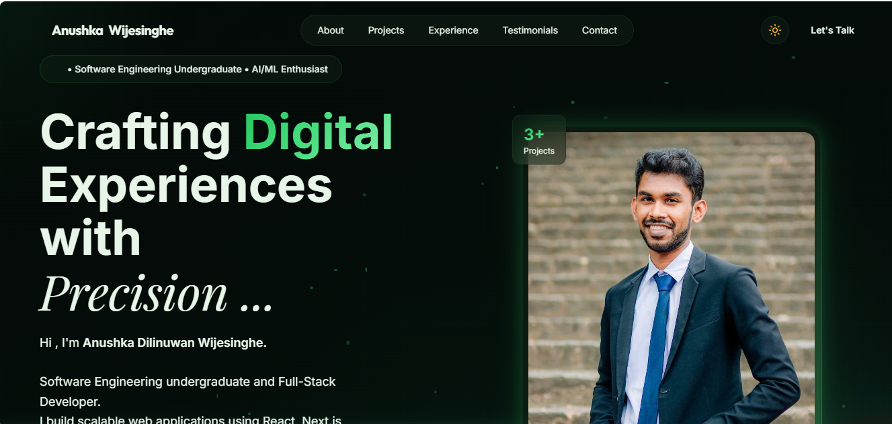

# 🚀 Anushka Dilinuwan Wijesinghe | Developer Portfolio

A modern, responsive developer portfolio built to showcase my projects, technical skills, and software engineering journey.

The portfolio focuses on **clean UI design, reusable React components, responsive layouts, and maintainable frontend architecture**, providing a professional introduction to my work as a **B.Sc. (Hons) Software Engineering undergraduate at the University of Kelaniya**.

---

## 🌐 Live Demo

**Portfolio:** https://anushka-portfolio-eight.vercel.app

---

## 📌 About

This portfolio serves as a central place to present:

* Software Engineering projects
* Technical skills
* Experience
* Education
* Certifications
* Contact information

The project was built with scalability and maintainability in mind using a component-based architecture.

---

## ✨ Features

* Modern glassmorphism-inspired interface
* Fully responsive design for desktop, tablet, and mobile
* Smooth navigation between sections
* Animated SVG button borders
* Interactive hover effects
* Reusable React components
* Clean folder structure
* Fast development with Vite
* Optimized asset loading
* Easy to maintain and extend

---

## 🛠 Tech Stack

### Frontend

* React 18
* Vite
* JavaScript (ES6+)
* Tailwind CSS
* HTML5
* CSS3

### Icons

* Lucide React

### Development Tools

* Git
* GitHub
* VS Code
* npm

### Deployment

* Vercel

---

## 📂 Project Structure

```text
src/
│
├── assets/
├── components/
├── layout/
├── sections/
├── App.jsx
├── main.jsx
└── index.css
```

---

## 🚀 Getting Started

Clone the repository

```bash
git clone https://github.com/WijAnushka02/Anushka_Portfolio.git
```

Navigate into the project

```bash
cd Anushka_Portfolio
```

Install dependencies

```bash
npm install
```

Start the development server

```bash
npm run dev
```

Build for production

```bash
npm run build
```

---

## 📈 Future Improvements

* Blog section
* Project filtering
* Better accessibility (WCAG improvements)
* SEO optimization
* Dynamic project data

---

## 📸 Preview

> Add a screenshot of the homepage here.



---

## 🤝 Connect With Me

**LinkedIn**

https://www.linkedin.com/in/anushka-wijesinghe-85445630a/

**GitHub**

https://github.com/WijAnushka02

**Email**

[anushkadilinuwan02@gmail.com](mailto:anushkadilinuwan02@gmail.com)

---

## ⭐ Support

If you found this project useful, consider giving it a ⭐ on GitHub.

---

Built by **Anushka Dilinuwan Wijesinghe**
